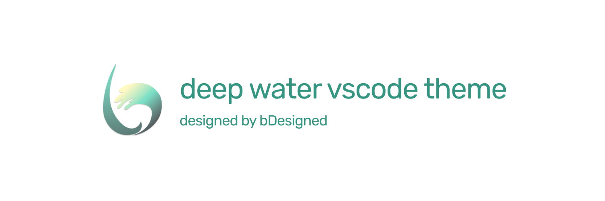
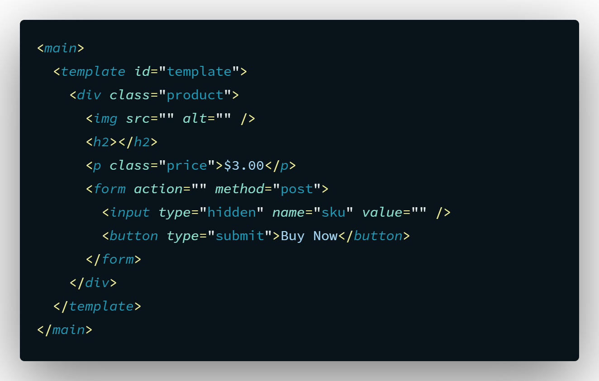
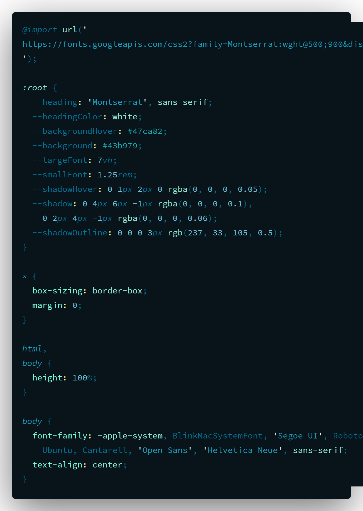
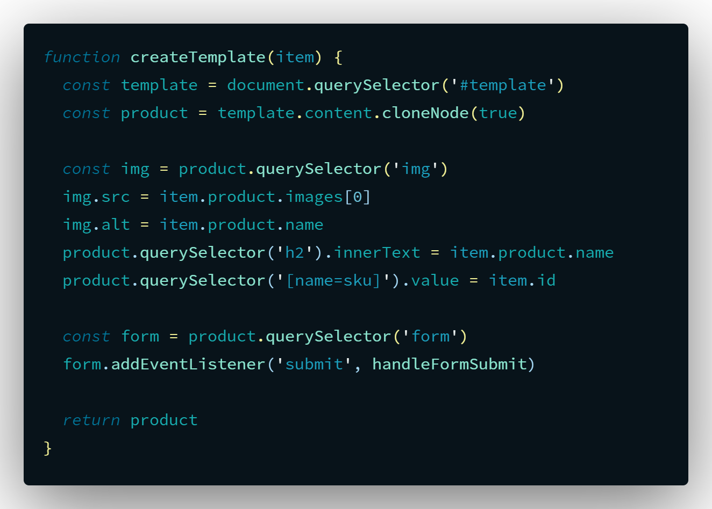

<!-- markdownlint-disable MD033 MD036 MD041-->

A color theme based on the colors of the ocean 🌊

 

[][self]
[][self]
[][self]

Currently only fully supports HTML, CSS, and JavaScript languages, pr's are welcome for other languages!

---

**HTML**

**CSS**

**JavaScript**

[self]: https://marketplace.visualstudio.com/items?itemName=bDesigned.deep-water
[license]: https://marketplace.visualstudio.com/items/bDesigned.deep-water/license

---

## Developer
 

---

## Contributors

@grikomsn
